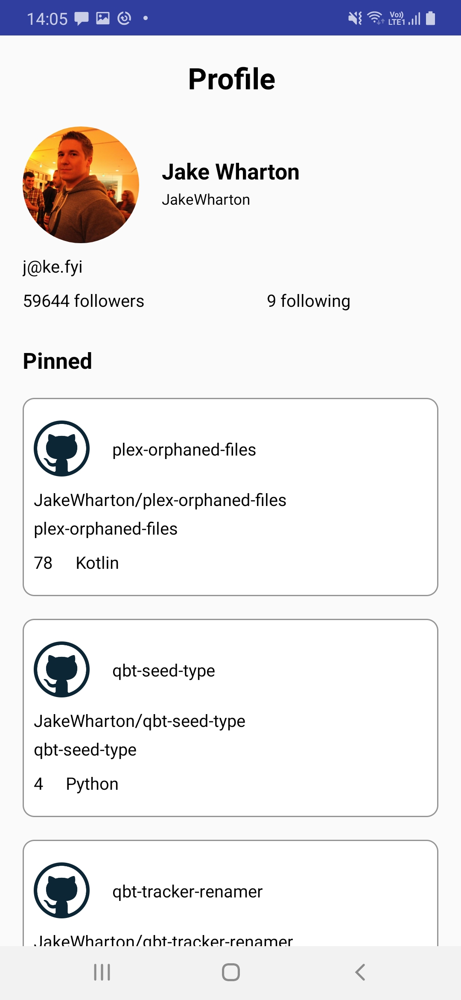
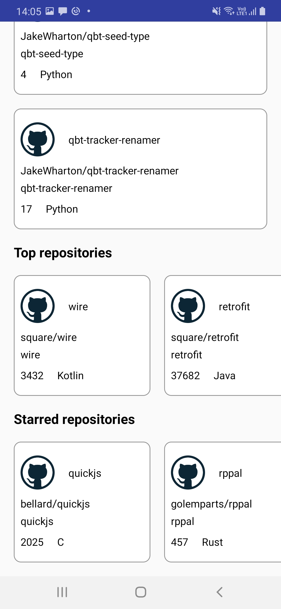

# GraphQL using Apollo-Android
This is an example of how to use apollo-android which is a compliant which helps in consuming graphQL APIs. This project consumes the v4 of Github API which is a GraphQL API.  

<b>Documentation</b>: https://docs.github.com/en/graphql   
It uses apollo-android for generating models according to the corresponding queries which help us to get results accordingly. 

Documentation: https://github.com/apollographql/apollo-android  

<pre>
query UserDetailQuery($owner:String!){
    user(login: $owner) {
        name
        login
        email
        avatarUrl
        followers {
            totalCount
        }
        following {
            totalCount
        }

        repositories(first : 3, orderBy: {field: CREATED_AT, direction:DESC}){
            nodes{
                name
                openGraphImageUrl
                nameWithOwner
                stargazerCount
                primaryLanguage{name}
            }
        }

        topRepositories(first : 10, orderBy: {field: CREATED_AT, direction:DESC}){
            nodes{
                name
                nameWithOwner
                stargazerCount
                primaryLanguage{name}
            }
        }

        starredRepositories(first : 10, orderBy: {field: STARRED_AT, direction:DESC}){
            nodes{
                name
                nameWithOwner
                stargazerCount
                primaryLanguage{name}
            }
        }
    }

}
</pre>
The result of the above query is shown below:

<b>Screenshots:</b>
  

